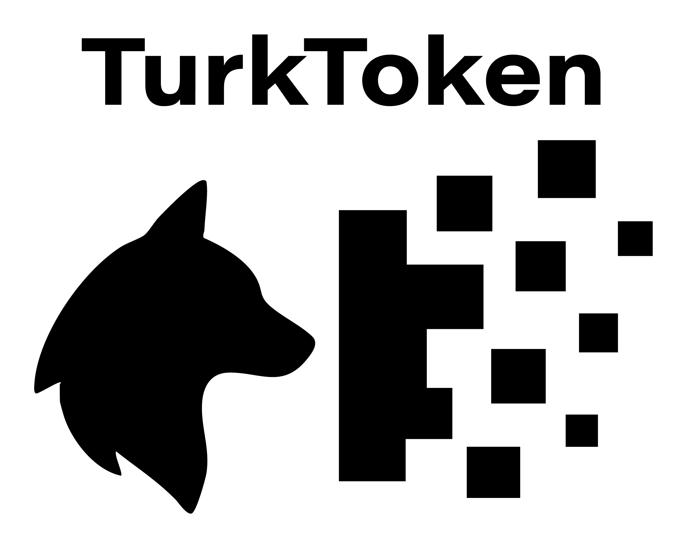

# TurkToken

TurkToken, **Türkçe için özel olarak geliştirilmiş bir tokenizasyon kütüphanesi ve demo uygulamasıdır**.  
Amaç, Türkçenin eklemeli (agglutinative) yapısına daha uygun çözümler sunarak, dil işleme çalışmalarında kullanılan token sayılarını azaltmak, nadir kelimelerle (OOV) daha iyi başa çıkmak ve dil modelleri için daha verimli bir altyapı oluşturmaktır.

<p align="center">
  
</p>

## Canlı Önizleme

👉 [Proje Sitesi - turktoken.org](https://turktoken.org)


## 🚀 Özellikler

- **Farklı tokenizasyon modları:**
  - [**An itibariyle geliştirilmekte**] Karakter tabanlı
  - [**An itibariyle geliştirilmekte**] Kelime tabanlı
  - [Yakın zamanda başlanacak] Alt-kelime tabanlı (BPE)
- **Türkçe’ye özgü zorluklara çözüm:**
  - Türkçe karakterlerin (ç, ğ, ı, İ, ö, ş, ü) korunması
  - Kesme işaretinin (`’` `'`) tutarlı biçimde işlenmesi
  - Ek sınırlarında daha doğru parçalama
- **Karşılaştırma imkânı:** SentencePiece ve WordPiece gibi yöntemlerle kıyaslama
- **Web demo:** Tarayıcı tabanlı, renkli token gösterimi ve hız ölçümleri

---

## 📦 Kurulum

Projeyi bilgisayarınıza klonlayın:

```bash
git clone https://github.com/kullanici/turktoken.git
cd turktoken
```

#  Detaylar

## Dosya Düzeni
```
turktoken/
├─ Gemfile                  # Ruby bağımlılıklarını tanımlar (Jekyll, eklentiler vs.)
├─ _config.yml              # Jekyll genel ayar dosyası
├─ _layouts/                # Sayfa şablonları
│  └─ yazar.html            # Yazar sayfaları için şablon
├─ _includes/               # Tekrar kullanılabilir HTML parçaları
│  └─ chart-top-words.html  # Plotly ile kelime sıklığı grafiği
├─ _yazarlar/               # Koleksiyon: her yazar için bir markdown dosyası
│  └─ ahmet-umit.md         # Örnek yazarın bilgileri (front matter)
├─ _data/                   # JSON veri dosyaları
│  └─ yazarlar/             # Yazar istatistikleri burada tutulur
│     └─ ahmet-umit.json    # Yazar slug’ına karşılık gelen kelime frekansları
├─ assets/                  # Stil ve JavaScript dosyaları
│  ├─ css/
│  │  └─ site.css           # Genel site stilleri
│  └─ js/
│     └─ site.js            # Genel site işlevleri
├─ yazarlar/                # Jekyll tarafından oluşturulan sayfalar
│  └─ index.md              # Tüm yazarların listelendiği sayfa
└─ index.md                 # Ana sayfa

```
